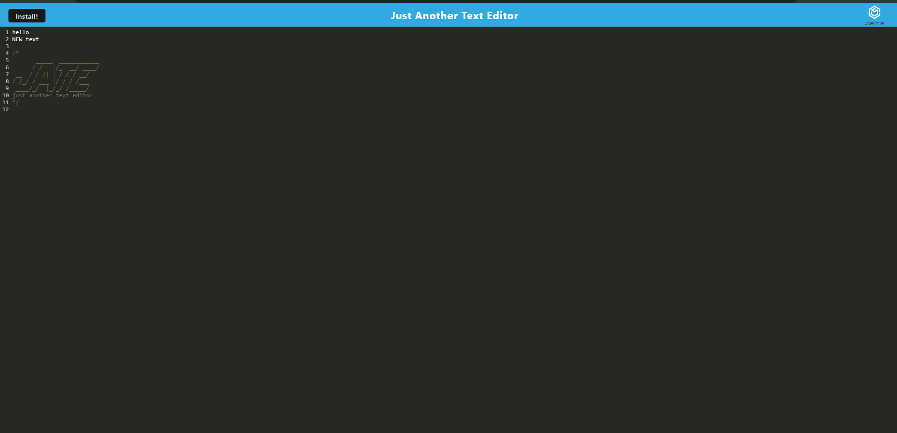

# Progams-With-Attitude

## Description

I was tasked with creating a PWA from an existing code base for a a Note taking application.

## Table of contents 

* [Usage](#usage)
* [Description](#description)
* [License](#license)
* [Contributing](#contributing)
* [Tests](#tests)
* [Questions](#questions)

## Usage
here is a link to the deployed application.
https://pwa-test-2022.herokuapp.com/

## Technologies Used
JavaScript
Heroku
Webpack
Github

##

## Contributing
Timothy Barnaby

## Tests
N/A

## Questions
Here is my GitHub if you would like to look over my projects [tbarns](https://github.com/tbarns)

Send me an email at  [tbarnaby1@gmail.com](mailto:tbarnaby1@gmail.com) if you would like to get in contact about working together in the future or have any questions. 

## License
MIT License

Copyright (c) 2022 Timothy Barnaby

Permission is hereby granted, free of charge, to any person obtaining a copy
of this software and associated documentation files (the "Software"), to deal
in the Software without restriction, including without limitation the rights
to use, copy, modify, merge, publish, distribute, sublicense, and/or sell
copies of the Software, and to permit persons to whom the Software is
furnished to do so, subject to the following conditions:

The above copyright notice and this permission notice shall be included in all
copies or substantial portions of the Software.

THE SOFTWARE IS PROVIDED "AS IS", WITHOUT WARRANTY OF ANY KIND, EXPRESS OR
IMPLIED, INCLUDING BUT NOT LIMITED TO THE WARRANTIES OF MERCHANTABILITY,
FITNESS FOR A PARTICULAR PURPOSE AND NONINFRINGEMENT. IN NO EVENT SHALL THE
AUTHORS OR COPYRIGHT HOLDERS BE LIABLE FOR ANY CLAIM, DAMAGES OR OTHER
LIABILITY, WHETHER IN AN ACTION OF CONTRACT, TORT OR OTHERWISE, ARISING FROM,
OUT OF OR IN CONNECTION WITH THE SOFTWARE OR THE USE OR OTHER DEALINGS IN THE
SOFTWARE.

